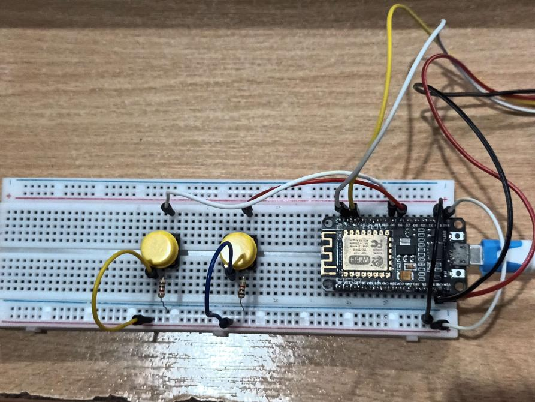
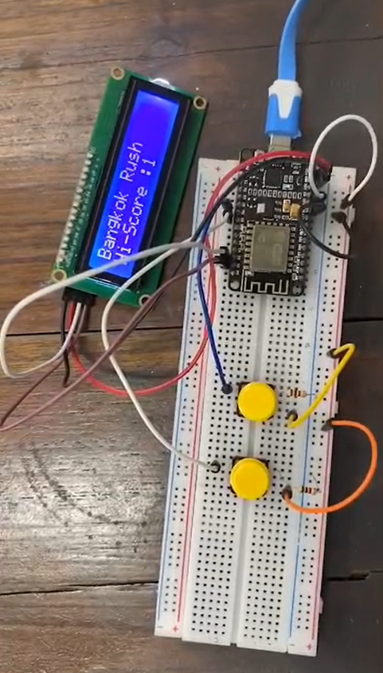

# Bangkok Rush

> Endless Running game with ESP 8266 Project for Programing IOT 01418234
> 

# Library Require

- LiquidCrystal_I2C.h
- Wire.h

# อุปกรณ์ที่ใช้

- บอร์ด ESP8266
- จอ LCD I2C 16*2
- ปุ่ม 4 ขา 2 ตัว
- ตัวต้านทานขนาด 1 กิโล โอมห์ 2 ตัว
- สายไฟคู่ ผู้ ผู้ 6 สาย
- สายไฟคู่ผู้เมีย 4 สาย สําหรับจอ LCD
- Bread Board
- สายโอนข้อมูลและจ่ายไฟ

# ขั้นตอนการต่อ

## ต่อบอร์ด ESP2866 ให้เรียบร้อย

## Set Up สาย

- สายสีขาว ทางด้านขวาสุดของรูปที่ต่อคร่อม บอร์ดอยู่คือ สายสําหรับการจ่ายไฟ 3V
- สายสีดํา ทาวด้านขวาของบอร์ดของรูปที่ต่อคร่อม บอร์ดอยู่คือ สายสําหรับ GND

### ปุ่ม  4 ขา

- ต่อปุ่มคร่อมราง
- จ่ายไฟจากขั้วบวกเข้า ขาที่ 1 ของปุ่มแต่ละปุ่ม
- หลังจากต่อออก ในปุ่มแรก ให้เอา D5 เป็น PIN input ต่อสายจากขา 4 ออกไปที่ D5 ได้เลย
- หลังจากน้้น ปุ่มที่สอง ให้เอา Input เป็น Pin D6 ต่อสายจากขา 4 ออกไปที่ D6 ได้เลย
- จากนั้นต่อสายดินโดยใช้ตัวต้านทานขนาด 1k ปักลง GND ที่เราได้ทําการ Jump ไว้

<aside>
💡 การต่อปุ่มเป็นการต่อแบบ Active High

</aside>

<aside>
💡 แนะนําว่า การจัดรูปแบบการรต่อ ควรจัดให้ปุ่มมันกดง่ายๆ

</aside>

### จอ LCD

- GND ต่อกับ GND ปกติ
- VCC ต่อกับ Vin
- SDA ต่อกับ D2
- SCA ต่อกับ D1

# Video

> File is too big
> 

# Display

Start the game

Game over 1

Game play 

High Score
